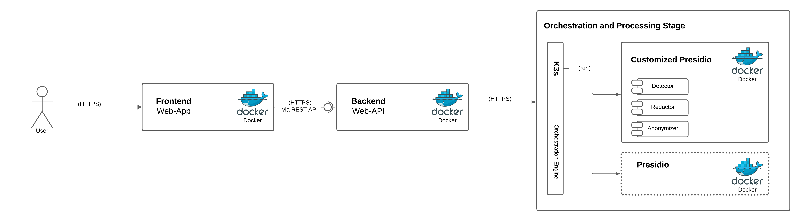
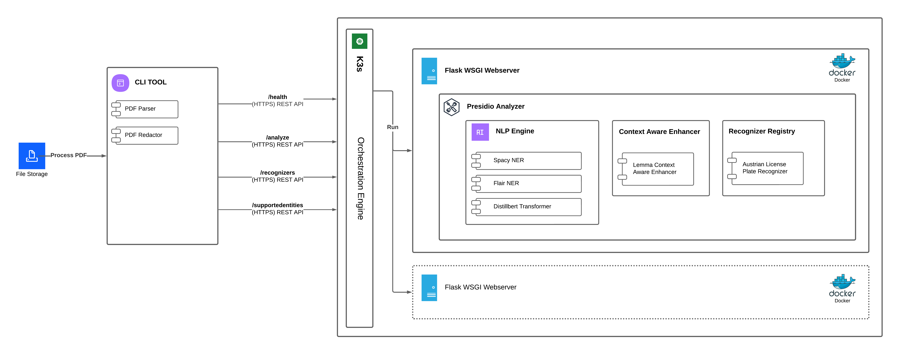

# System Architecture

:::info
The legacy system architecture is included for completeness, but can generally be ignored.
:::

## Legacy Architecture

The original requirements specified the need for a frontend (Vue) and a backend to serve it. However, since DVT already provides well-established solutions for these components, they are not part of the current architecture.

---

## Current System Architecture

The current system, illustrated below, omits both the frontend and backend. Instead, it focuses on a CLI tool that enables operators to perform various operations on PDF documents.

### 1. Components

#### CLI Tool

A Python application that runs on-premises. It accepts PDF documents as input, extracts their text layers, and communicates with the Flask WSGI web server for PII detection. The results are used to redact or highlight PII directly within the document.

#### K3s

A lightweight Kubernetes distribution with a minimal memory footprint, used to deploy and manage one or more instances of the Flask WSGI web server.

#### Flask WSGI Web Server

The core component of GUARD. This web server exposes several endpoints: `/health`, `/analyze`, `/recognizers`, and `/supportedentities`. It is built on top of [Microsoft Presidio](https://github.com/microsoft/presidio), an open-source project (MIT license) for PII detection and anonymization. GUARD customizes Presidio by integrating custom NLP engines, context-aware enhancers, and a recognizer registry for both default (e.g., Email, Phone number) and custom regex-based recognizers, like those for Austrian license plates.

- **NLP Engine:**  
  Rigorous evaluation on a custom, synthetic Austrian dataset was performed to select the best models. The chosen models—[spaCy](https://spacy.io/usage/models), [Flair](https://github.com/flairNLP/flair), and [DistilBERT](https://huggingface.co/yonigo/distilbert-base-multilingual-cased-pii)—achieved an F2 score above 0.8 in the target language (German). All evaluation scripts and results can be found under [processing_experiments/experiment](https://github.com/Land-Tirol-DVT-GmbH/guard/tree/main/processing_experiments/experiment). These models effectively detect various PII types in provided text, and Presidio maps their labels to its supported entities. For example, `DistilBERT` detects `GIVENNAME1` and `GIVENNAME2`, which Presidio maps to the `PERSON` entity.

- **Context-Aware Enhancer:**  
  GUARD utilizes the Lemma Context-Aware Enhancer from Presidio, which increases detection accuracy by considering context words adjacent to identified entities. For example, in "My *phone number* is 333 3333333", the presence of context words like *phone number* increases the confidence that the matched number is indeed a phone number.

- **Recognizer Registry:**  
  This registry manages various entity recognizers, including regex-based ones. For example, the `Austrian License Plate Recognizer` uses regular expressions to identify license plates. For more details, see the [Presidio Documentation](https://microsoft.github.io/presidio/analyzer/).
